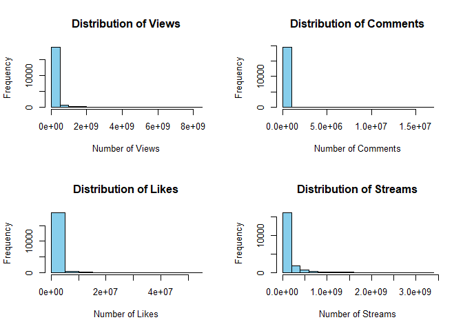
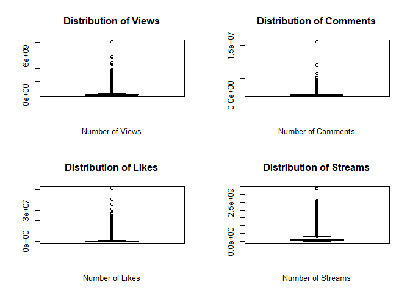
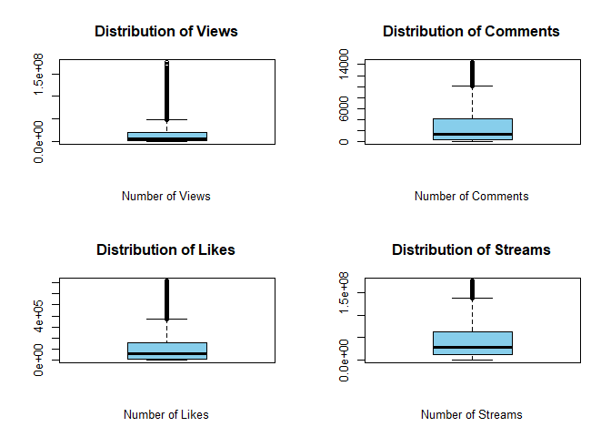
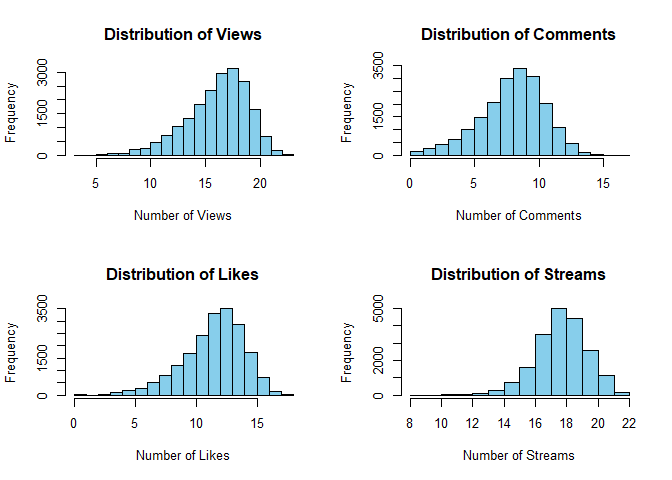
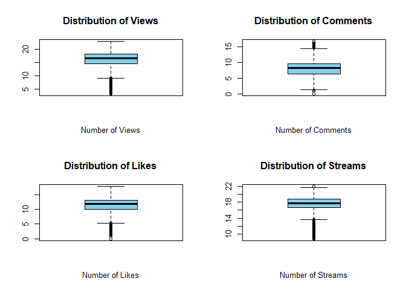
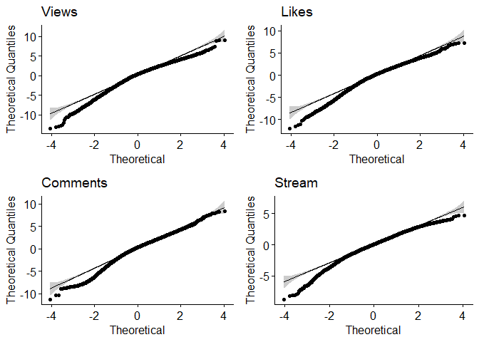
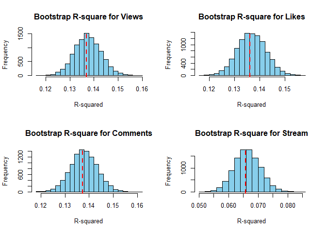

Multivariate Analysis Report
================
Connor King
2023-05-17

- [Dataset](#dataset)
- [Project Goal](#project-goal)
  - [Variable Descriptions](#variable-descriptions)
- [Exploratory Data Analysis](#exploratory-data-analysis)
  - [`NA` values](#na-values)
  - [Popularity/Dependent Variables](#popularitydependent-variables)
  - [Independent Variables](#independent-variables)
  - [Correlation Plot](#correlation-plot)
- [Multiple Multivariate Regression](#multiple-multivariate-regression)
  - [Diagnostic Checks](#diagnostic-checks)
  - [Log-transformation](#log-transformation-1)
  - [R-sq and Bootstrap Study](#r-sq-and-bootstrap-study)
  - [Bootstrap](#bootstrap)
  - [Regression Analysis](#regression-analysis)
  - [Variable Omission](#variable-omission)
  - [Regression Conclusion](#regression-conclusion)
- [One-Way MANOVA](#one-way-manova)
  - [Visualizations](#visualizations)
  - [Testing](#testing)
  - [Assumptions Check](#assumptions-check)
  - [MANOVA Conclusion](#manova-conclusion)

## Dataset

**Description**

The dataset is a combination of data from Spotify and Youtube and
consists of several attributes.

The Spotify data includes various characteristics of songs, like
`Danceability`, `Energy`, `Key`, `Loudness`, `Speechiness`,
`Acousticness`, `Instrumentalness`, `Liveness`, `Valence`, `Tempo`, and
`Duration_ms`.

The Youtube data, on the other hand, consists of dependent variables
that measure the popularity of these songs on Youtube where the number
of `Views`, `Likes`, `Comments` are tracked for the corresponding music
video.

The dependent variable of `Stream` was from Spotify which represents the
number of times a particular song or track has been played or listened
to on Spotify.

    ## ── Attaching core tidyverse packages ──────────────────────── tidyverse 2.0.0 ──
    ## ✔ dplyr     1.1.2     ✔ readr     2.1.4
    ## ✔ forcats   1.0.0     ✔ stringr   1.5.0
    ## ✔ ggplot2   3.4.2     ✔ tibble    3.2.1
    ## ✔ lubridate 1.9.2     ✔ tidyr     1.3.0
    ## ✔ purrr     1.0.1     
    ## ── Conflicts ────────────────────────────────────────── tidyverse_conflicts() ──
    ## ✖ dplyr::filter() masks stats::filter()
    ## ✖ dplyr::lag()    masks stats::lag()
    ## ℹ Use the ]8;;http://conflicted.r-lib.org/conflicted package]8;; to force all conflicts to become errors
    ## New names:
    ## Rows: 20718 Columns: 28
    ## ── Column specification ────────────────────────────────────────────────────────
    ## Delimiter: ","
    ## chr (10): Artist, Url_spotify, Track, Album, Album_type, Uri, Url_youtube, T...
    ## dbl (16): ...1, Danceability, Energy, Key, Loudness, Speechiness, Acousticne...
    ## lgl  (2): Licensed, official_video
    ## 
    ## ℹ Use `spec()` to retrieve the full column specification for this data.
    ## ℹ Specify the column types or set `show_col_types = FALSE` to quiet this message.

## Project Goal

In this project I will seek to answer various questions via multivariate
analysis. I will attempt to answer:

1.  Can we predict the popularity of a song with the help of Spotify
    audio features?

I will achieve this via *multiple multivariate regression analysis* and
include a *bootstrap study* to calculate confidence intervals for the
R-squared values.

2.  Are there differences in the means of the popularity variables
    between Album_types? (album, compilation, single)

I will utilize *one-way MANOVA*.

### Variable Descriptions

**Independent Variables**

- `Album_type`: the album in which the song is contained on Spotify.
  (album, single, compilation)
- `Danceability`: describes how suitable a track is for dancing based on
  a combination of musical elements including tempo, rhythm stability,
  beat strength, and overall regularity.
- `Energy`: is a measure from 0.0 to 1.0 and represents a perceptual
  measure of intensity and activity.
- `Key`: the key the track is in. Integers map to pitches using standard
  Pitch Class notation.
- `Loudness`: the overall loudness of a track in decibels (dB). Loudness
  values are averaged across the entire track and are useful for
  comparing relative loudness of tracks.
- `Speechiness`: detects the presence of spoken words in a track. The
  more exclusively speech-like the recording (e.g. talk show, audio
  book, poetry), the closer to 1.0 the attribute value.
- `Acousticness`: a confidence measure from 0.0 to 1.0 of whether the
  track is acoustic. 1.0 represents high confidence the track is
  acoustic.
- `Instrumentallness`: predicts whether a track contains no vocals. The
  closer the instrumentalness value is to 1.0, the greater likelihood
  the track contains no vocal content.
- `Liveness`: detects the presence of an audience in the recording.
  Higher liveness values represent an increased probability that the
  track was performed live.
- `Valence`: tracks with high valence sound more positive (e.g. happy,
  cheerful, euphoric), while tracks with low valence sound more negative
  (e.g. sad, depressed, angry).
- `Tempo`: the overall estimated tempo of a track in beats per minute
  (BPM).
- `Duration_ms`: the duration of the track in milliseconds.

**Popularity/Dependent Variables**

- `Stream`: the number of streams of the song on Spotify.
- `Likes`: the number of likes of the song’s corresponding music video
  on YouTube
- `Views`: the number of views of the YouTube video
- `Comments`: the number of comments for the YouTube video

## Exploratory Data Analysis

    ##   Album_type         Danceability        Energy               Key      
    ##  Length:20718       Min.   :0.0000   Min.   :0.0000203   Min.   : 0.0  
    ##  Class :character   1st Qu.:0.5180   1st Qu.:0.5070000   1st Qu.: 2.0  
    ##  Mode  :character   Median :0.6370   Median :0.6660000   Median : 5.0  
    ##                     Mean   :0.6198   Mean   :0.6352503   Mean   : 5.3  
    ##                     3rd Qu.:0.7402   3rd Qu.:0.7980000   3rd Qu.: 8.0  
    ##                     Max.   :0.9750   Max.   :1.0000000   Max.   :11.0  
    ##                     NA's   :2        NA's   :2           NA's   :2     
    ##     Loudness        Speechiness       Acousticness       Instrumentalness   
    ##  Min.   :-46.251   Min.   :0.00000   Min.   :0.0000011   Min.   :0.0000000  
    ##  1st Qu.: -8.858   1st Qu.:0.03570   1st Qu.:0.0452000   1st Qu.:0.0000000  
    ##  Median : -6.536   Median :0.05050   Median :0.1930000   Median :0.0000024  
    ##  Mean   : -7.672   Mean   :0.09646   Mean   :0.2915353   Mean   :0.0559616  
    ##  3rd Qu.: -4.931   3rd Qu.:0.10300   3rd Qu.:0.4772500   3rd Qu.:0.0004630  
    ##  Max.   :  0.920   Max.   :0.96400   Max.   :0.9960000   Max.   :1.0000000  
    ##  NA's   :2         NA's   :2         NA's   :2           NA's   :2          
    ##     Liveness         Valence           Tempo        Duration_ms     
    ##  Min.   :0.0145   Min.   :0.0000   Min.   :  0.0   Min.   :  30985  
    ##  1st Qu.:0.0941   1st Qu.:0.3390   1st Qu.: 97.0   1st Qu.: 180010  
    ##  Median :0.1250   Median :0.5370   Median :120.0   Median : 213284  
    ##  Mean   :0.1935   Mean   :0.5299   Mean   :120.6   Mean   : 224718  
    ##  3rd Qu.:0.2370   3rd Qu.:0.7262   3rd Qu.:139.9   3rd Qu.: 252443  
    ##  Max.   :1.0000   Max.   :0.9930   Max.   :243.4   Max.   :4676058  
    ##  NA's   :2        NA's   :2        NA's   :2       NA's   :2        
    ##      Views               Likes             Comments            Stream         
    ##  Min.   :0.000e+00   Min.   :       0   Min.   :       0   Min.   :6.574e+03  
    ##  1st Qu.:1.826e+06   1st Qu.:   21581   1st Qu.:     509   1st Qu.:1.767e+07  
    ##  Median :1.450e+07   Median :  124481   Median :    3277   Median :4.968e+07  
    ##  Mean   :9.394e+07   Mean   :  663341   Mean   :   27519   Mean   :1.359e+08  
    ##  3rd Qu.:7.040e+07   3rd Qu.:  522148   3rd Qu.:   14360   3rd Qu.:1.384e+08  
    ##  Max.   :8.080e+09   Max.   :50788652   Max.   :16083138   Max.   :3.387e+09  
    ##  NA's   :470         NA's   :541        NA's   :569        NA's   :576

### `NA` values

    ## # A tibble: 1,169 × 16
    ##    Album_type Danceability Energy   Key Loudness Speechiness Acousticness
    ##    <chr>             <dbl>  <dbl> <dbl>    <dbl>       <dbl>        <dbl>
    ##  1 album             0.566  0.834     6    -8.41      0.0298     0.00277 
    ##  2 album             0.547  0.394     4    -9.79      0.0262     0.0522  
    ##  3 album             0.539  0.828     4    -9.11      0.035      0.00067 
    ##  4 album             0.531  0.583     7    -9.47      0.0256     0.0184  
    ##  5 album             0.438  0.687     7    -9.15      0.0619     0.000668
    ##  6 album             0.512  0.86      0    -6.14      0.0703     0.00631 
    ##  7 album             0.624  0.876     7    -6.00      0.0342     0.000926
    ##  8 album             0.404  0.266    10   -16.7       0.0334     0.716   
    ##  9 single            0.878  0.786    11    -5.27      0.152      0.416   
    ## 10 album             0.736  0.727     5    -4.64      0.0571     0.0584  
    ## # ℹ 1,159 more rows
    ## # ℹ 9 more variables: Instrumentalness <dbl>, Liveness <dbl>, Valence <dbl>,
    ## #   Tempo <dbl>, Duration_ms <dbl>, Views <dbl>, Likes <dbl>, Comments <dbl>,
    ## #   Stream <dbl>

Here are the percent `NA`’s for every variable

    ##       Album_type     Danceability           Energy              Key 
    ##      0.000000000      0.009653441      0.009653441      0.009653441 
    ##         Loudness      Speechiness     Acousticness Instrumentalness 
    ##      0.009653441      0.009653441      0.009653441      0.009653441 
    ##         Liveness          Valence            Tempo      Duration_ms 
    ##      0.009653441      0.009653441      0.009653441      0.009653441 
    ##            Views            Likes         Comments           Stream 
    ##      2.268558741      2.611255913      2.746404093      2.780191138

The `NA` values are predominantly found within the popularity variables.
Since the percentages are small (all less than 3%) and are seemingly
random I will remove them for easier analysis.

### Popularity/Dependent Variables

<!-- -->

As shown, there seems to be large outliers that skew the distributions
and makes it difficult to see visually.

<!-- -->

The boxplots again show that the outliers seem to be heavily influencing
the distributions thus I will consider omitting them.

#### Omitting Outliers

<!-- -->
<!-- -->

The distributions are easier to visualize now; however, they are still
all right skewed which will have some implications with the assumptions
of the analyses and models we plan to perform.

#### Log-Transformation

Now I will consider a log-transformation of the popularity variables:

<!-- -->

    ## Warning in bplt(at[i], wid = width[i], stats = z$stats[, i], out =
    ## z$out[z$group == : Outlier (-Inf) in boxplot 1 is not drawn

    ## Warning in bplt(at[i], wid = width[i], stats = z$stats[, i], out =
    ## z$out[z$group == : Outlier (-Inf) in boxplot 1 is not drawn

<!-- -->

The distributions now look much more normal so I will consider using a
log-transformation within some of our analyses.

Note: normality of predictors is not a requirement for MANOVA and
regression.

### Independent Variables

<!-- -->

From the histograms we see that `Acousticeness` is right skewed,
`Liveness` is right skewed, `Loudness` is left skewed, `Speechiness` is
right skewed, and `Duration_ms` and `Instrumentalness` seem to be
heavily influenced by extreme outliers in regards to their skewness.

`Key` is represeneted as a numerical variable within the dataset. It is
a descrete numerical variable, but it is also a categorical variable. In
music theory, the difference between the keys is not numerical but
categorical thus it should be treated as a factor rather than a numeric
variable within a regression model.

In regards to `Duration_ms` and `Instrumentalness`, we will not remove
these extreme outliers. For `duration_ms`, it is plausible that there
might be some very long songs. For `Instrumentalness`, there are songs
that are completely instrumental. These can be valuable in terms of
understanding the relationships between variables. Since linear
regression models can be highly sensitive to outliers, we will consider
using a log-transformation to minimize the impact of these extreme
values.

### Correlation Plot

    ## corrplot 0.92 loaded

<!-- -->

From the correlation plot, we can see some trends at a glance.

`Acousticness` seems to be negatively correlated with several variables,
especially `Energy` and `Loudness`.

`Intrumentalness` also seems to be negatively correlation with several
variables except `Acousticness`.

`Energy` seems to have a positive correlation between `Loudness`, and
`Valence`. The relationship with `Loudness` is predictable, however it’s
interesting to see that a song with higher energy is correlated with
higher positivity.

## Multiple Multivariate Regression

Question: Can we predict the popularity of a song with the help of
Spotify audio features?

- The popularity statistics (dependent variables) would be the
  **views**, **comments**, and **likes** from its corresponding YouTube
  music video and **streams** from spotify.

<!-- -->

    ##                          Views         Likes      Comments        Stream
    ## const             1.420745e+08  1.115131e+06  3.740722e+04  3.285848e+08
    ## Danceability      1.014951e+08  8.449074e+05  2.989411e+04  6.147578e+07
    ## Energy           -5.195799e+07 -4.466926e+05 -5.177572e+03 -1.315131e+08
    ## Key               4.075534e+05  2.025938e+03  2.842455e+02 -6.553343e+05
    ## Loudness          7.200323e+06  5.312133e+04  1.907660e+03  7.596754e+06
    ## Speechiness      -7.264448e+07 -1.349480e+05  1.652109e+03 -7.639498e+07
    ## Acousticness     -1.725573e+07 -1.748695e+05 -1.940081e+04 -8.530428e+07
    ## Instrumentalness -1.424082e+07 -3.946083e+04  3.961921e+03 -3.714135e+07
    ## Liveness         -2.341561e+07 -2.042061e+05 -1.740208e+04 -4.380464e+07
    ## Valence          -1.743117e+07 -3.723382e+05 -8.379393e+03 -5.766546e+07
    ## Tempo            -7.688880e+04 -1.554010e+02  1.153721e+01 -4.666605e+04
    ## Duration_ms       5.266540e+01  1.291697e-01 -7.277566e-04 -2.739933e+01

Calculating R-sq:

    ##      Views      Likes   Comments     Stream 
    ## 0.01938851 0.02339462 0.00494112 0.03038258

As shown, the R-squared values are very low.

### Diagnostic Checks

Since our multivariate multiple regression model has been fit to the
data, we must perform diagnostic checks for the single-response model.

We will examine the residual vectors
$[\hat{\epsilon}_{j1}, \hat{\epsilon}_{j2}, \hat{\epsilon}_{j3}, \hat{\epsilon}_{j4}]$
for normality or outliers.

    ## # A tibble: 6 × 4
    ##     Obs Dependent Prediction   Residual
    ##   <int> <chr>          <dbl>      <dbl>
    ## 1     1 Views     103047048. 590508173.
    ## 2     1 Likes        717869.   5503027.
    ## 3     1 Comments      31614.    138293.
    ## 4     1 Stream    133226841. 907008013.
    ## 5     2 Views     119320444. -47308799.
    ## 6     2 Likes        745026.    334102.

Since our data has now been reshaped, we can plot the residual plots for
each popularity metric

<!-- -->

There are several issues with these residual plots. They appear to be
biased and heteroscedastic. The model also seems to underestimate as
there appears to be far more positive residuals than negative.

### Log-transformation

As we saw in our exploratory data analysis, it may be necessary to
consider transformations. We will log-transform `Duration_ms` and
`Instrumentalness` and then transform the popularity variables.

    ## # A tibble: 6 × 4
    ##     Obs Dependent Prediction Residual
    ##   <int> <chr>          <dbl>    <dbl>
    ## 1     1 Views          16.4      3.94
    ## 2     1 Likes          11.7      3.97
    ## 3     1 Comments        8.00     4.04
    ## 4     1 Stream         17.5      3.25
    ## 5     2 Views          16.5      1.63
    ## 6     2 Likes          11.6      2.29

<!-- -->

The `Comments` residual plot appears to show some bias with a linear
trend near the bottom of the plot. The line could be the result of
horizontal values for one of the variables (further analysis would be
needed). However, despite the plots not being perfectly homoscedastic,
these residuals plots are certainly an improvement and thus a
log-transformation will continue to be used for analysis.

#### Checking for normality

<!-- -->

The Q-Q plots appear to show approximate normality.

### R-sq and Bootstrap Study

    ##      Views      Likes   Comments     Stream 
    ## 0.13685297 0.13620214 0.13727603 0.06582931

The R-squared values are still low; however, they are greater than the
R-squared values of the non-transformed model. These values are rather
impressive given the complexity behind predicting performance of a song.

### Bootstrap

We will conduct a bootstrap study with 10,000 samples to create a 95%
confidence interval for the R-squared values.

    ##            [,1]      [,2]      [,3]       [,4]
    ## 2.5%  0.1269251 0.1259203 0.1270456 0.05803048
    ## 97.5% 0.1482288 0.1478588 0.1487247 0.07535721

#### Bootstrap Plots

<!-- -->

Here are the plots of the Boostrapped distributions for the R-square
values. The red line indicates the actual R-square value we calculated.

**Interpretation**

We are 95% confident that the lower endpoint and the higher endpoint for
the intervals represents the percentage of variance (when multiplied by
100) of `Views`, `Likes`, `Comments`, and `Stream` that can be explained
by our model.

All of our R-sq values from the regression earlier were contained in
their respective confidence intervals.

### Regression Analysis

    ##                         Views        Likes     Comments       Stream
    ## const             0.116331795  0.392121615 -7.913943445 15.170056746
    ## Danceability      1.517486685  1.861599903  1.419443827  0.332856109
    ## Energy           -0.704466516 -0.839971901 -0.347103965 -1.048839393
    ## Key               0.010857331  0.009617646  0.009131695 -0.003657463
    ## Loudness          0.150321091  0.159307892  0.143565644  0.066145307
    ## Speechiness      -2.112394395 -1.242918042 -1.219679726 -2.045533057
    ## Acousticness     -0.166252350 -0.226830900 -0.574589526 -0.551188594
    ## Instrumentalness -1.691182704 -1.044767159 -1.152998692 -0.648563783
    ## Liveness         -0.128419813 -0.257898791 -0.305267855 -0.381494472
    ## Valence          -0.227991474 -0.794879092 -0.863124819 -0.308903935
    ## Tempo             0.002264389  0.002362187  0.001794977  0.001194125
    ## Duration_ms       1.365756885  0.976585560  1.358752413  0.320609869

- `Danceability` seems to be positively associated with all four
  popularity variables (Views, Likes, Comments, Stream). It shows the
  largest effect on Likes.

- `Energy` has a negative effect on all four popularity variables. It
  seems to have the largest negative effect on Comments.

- `Key` shows a small positive effect on Views, Likes, and Comments, but
  a tiny negative effect on Stream.

- `Loudness` is positively associated with all popularity variables,
  with its effect being smallest on Stream.

- `Speechiness` negatively affects all popularity variables. It shows
  the largest negative effect on Stream.

- `Acousticness` is negatively associated with all popularity variables,
  with its largest negative effect on Comments.

- `Instrumentalness` has a negative effect on all popularity variables,
  with its largest negative effect on Comments.

- `Liveness` has a negative effect on all popularity variables, with its
  largest negative effect on Comments.

- `Valence` is negatively associated with all popularity variables, with
  its largest negative effect on Comments.

- `Tempo` has a tiny positive effect on all popularity variables, with
  its largest positive effect on Likes.

- `Duration_ms` shows a positive effect on Views, Likes, and Comments,
  but a smaller effect on Stream.

These are broad interpretations of each variable’s effect estimated
effect when all other variables are held constant. The actual
relationships may be more complex, especially since interactions between
variables may be present.

### Variable Omission

From the analysis above, we will conduct a likelihood ratio test for
regression parameters to see if a subset of the predictors has a
statistically significant linear relationship to the outcome.

The variables `Key` and `Tempo` have very small coefficients for all
popularity variables suggesting that their contributions may be
negligible.

$H_0: \beta_{Key} = \beta_{Tempo} = 0$

    ## [1] "Reject H0"

    ## [1] 0

We rejected $H_0$ which means that we cannot drop all of `Key` and
`Tempo`. The result indicates that at least one of the coefficients for
these variables is significantly different from zero.

We will now instead conduct the likelihood ratio test both `Key` and
`Tempo` separately.

- Testing $H_0: \beta_{Key} = 0$

<!-- -->

    ## [1] "Reject H0"

    ## [1] 0.01261183

Since we rejected $H_0$ at the $\alpha = 0.05$ level, we cannot drop
`Key`.

- Now testing $H_0: \beta_{Tempo} = 0$

<!-- -->

    ## [1] "Reject H0"

    ## [1] 6.084174e-05

The test results indicated that `Key` and `Tempo`do have a significant
linear relationship with the outcomes.

Since we are using the log-transformed model, the magnitude of a
coefficient doesn’t directly correspond to the magnitude of its effect
on the outcome. Instead, each coefficient represents the average
percentage change in the outcome for each one-unit increase in the
corresponding predictor, all else being equal.

### Regression Conclusion

**Model Performace**: The R-squared values for the non-transformed model
are very low. However, the R-squared values for our log-transformed
model were very reasonable given the difficulty of the research question
at hand. This result suggests our model does a reasonable job at
explaining variance and can decently predict a song’s popularity.

**Feature Importance**: *Danceability*, *Loudness*, and *Duration_ms*
seemed to have a positive association with song popularity across all
metrics (Views, Likes, Comments, Stream). *Energy*, *Speechiness*,
*Acousticness*, *Instrumentalness*, *Liveness*, and *Valence* were
negatively associated with song popularity across all metrics.

**Omission**: *Key* and *Tempo*, despite having smaller coefficients,
could not be omitted from the model as they showed a statistically
significant linear relationship with the outcome variables.

**Improvements**: Given the model performance, future research could
look into the interaction effects between variables or other non-linear
relationships. Additional variables not considered in this study may
also contribute to song popularity.

## One-Way MANOVA

Question: Are there differences in the means of the popularity variables
between Album_types? (album, compilation, single)

We will compare group means with `Album_type` as factors.

### Visualizations

<!-- -->

<!-- -->

### Testing

$$H_0: \boldsymbol{\tau}_{album} + \boldsymbol{\tau}_{compilation} + \boldsymbol{\tau}_{single} = 0$$

    ## New names:
    ## Rows: 20718 Columns: 28
    ## ── Column specification
    ## ──────────────────────────────────────────────────────── Delimiter: "," chr
    ## (10): Artist, Url_spotify, Track, Album, Album_type, Uri, Url_youtube, T... dbl
    ## (16): ...1, Danceability, Energy, Key, Loudness, Speechiness, Acousticne... lgl
    ## (2): Licensed, official_video
    ## ℹ Use `spec()` to retrieve the full column specification for this data. ℹ
    ## Specify the column types or set `show_col_types = FALSE` to quiet this message.
    ## • `` -> `...1`

From the `jmv` package, we tried to utilize `mancova`, however the
sample size was too large:

``` r
library(jmv)

(package <- mancova(data = df,
                    deps = vars(Views, Likes, Comments, Stream),
                    factors = Album_type))
```

    ## Error in mvnormtest::mshapiro.test(dataDeps): sample size must be between 3 and 5000

Thus we will compute MANOVA manually:

``` r
n <- nrow(df1)
g <- length(levels(as.factor(df1$Album_type)))
p <- ncol(df1[, c(13:16)])

nms <- function(data) {
  list(
    n = nrow(data),
    m = matrix(colMeans(data), ncol = 1),
    S = cov(data)
  )
}

sum_by_type <- 
  df1[, 13:16] %>%
  split(as.factor(df1$Album_type)) %>%
  map(nms)

W <- #within-group sum of squares and cross product-matrix
  sum_by_type %>%
  map(~ (.x$n - 1) * .x$S) %>%
  reduce(`+`)

xbar <- 
  sum_by_type %>%
  map(~ .x$n * .x$m) %>%
  reduce(`+`) / n

B <- #between-group sum of squares and cross-product matrix
  sum_by_type %>%
  map(~ .x$n * (.x$m - xbar) %*% t(.x$m - xbar)) %>%
  reduce(`+`)

Wilks_Lambda <- det(W) / det(W + B)

test_statistic <- ((n - p - 2) / p) * ((1 - sqrt(Wilks_Lambda)) / sqrt(Wilks_Lambda))
critical_value <- qf(0.05, 2 * p, 2 * (n - p - 2), lower.tail = FALSE)

ifelse(test_statistic > critical_value,
       "Reject H0",
       "Do not reject H0")
```

    ## [1] "Reject H0"

``` r
Wilks_Lambda
```

    ## [1] 0.9716063

We reject $H_0$ suggesting that the means between the groups of
`Album_type` are different. Despite Wilk’s Lambda being a large value,
we still rejected. This can be explained by the large sample size.

### Assumptions Check

- The dataset is assumed to be a random sample from from different
  populations that are independent.

- Since our sample size for each group is large, the assumption of each
  population being multivariate normal can be relaxed by appealing to
  the central limit theorem.

#### Testing for equality of Covariance Matrices via the **Box’s M-test**:

An important assumption of MANOVA is the equality of covariance matrices
across our groups. Essentially, this means we assume the variability
within our groups and the relationships among our dependent variables
are the same for all `Album_types`. We used Box’s M test to check this
assumption.

$$H_0: \boldsymbol{\Sigma}_{album} + \boldsymbol{\Sigma}_{compilation} + \boldsymbol{\Sigma}_{single} = \boldsymbol{\Sigma}$$

    ## [1] 6788.335

    ## [1] 20

    ## [1] TRUE

    ## [1] 0

Unfortunately, we found that the assumption of equal covariance matrices
was violated. This suggests that the relationships among our popularity
variables may not be the same across different Album_types, which is a
concern for the interpretation of our MANOVA results. Despite finding
significant results in our initial MANOVA, the violation of the equal
covariance matrices assumption suggests we should interpret these
results with caution.

### MANOVA Conclusion

- Significant differences found in the popularity means across different
  `Album_types`.

- Rejection of the null hypothesis according to the Wilk’s Lambda test.

- Violation of equal covariance matrices assumption detected by the
  Box’s M-test.

- Results should be interpreted with caution due to the violation of the
  assumption.

- Additional studies are required to explore and correct for the unequal
  covariance matrices, possibly considering interactions, different
  statistical methods or data transformations.
