# Spotify-YouTube-Multiavariate-Analysis
In this project, I use various multivariate analysis techniques to assess the popularity of music tracks by analyzing several audio metrics derived from Spotfiy in combination with some popularity metrics from YouTube. The project was entirely coded in R and uses packages such as `tidyverse`, `corrplot`, and `ggpubr`. These packages were mainly used for data wrangling and visualization. Majority of the mulvariate analysis was coded from scratch using the theoretical formulas. 

## Table of Contents

1. [Dataset](#dataset)
    - [Description](#description)
    - [Variables](#variables)
2. [Project Goal](#project-goal)
3. [Exploratory Data Analysis](#Exploratory-Data-Analysis)
4. [Multiple Multivariate Regression Analysis](#Multiple-Multivariate-Regression-Analysis)
5. [MANOVA](#MANOVA)
6. [Results](#results)
    - [Multiple Multivariate Regression](#Multiple-Multivariate-Regression-Analysis)
    - [MANOVA](#One-Way-MANOVA)

## Dataset

### Description

The dataset was retrieved from [Kaggle](https://www.kaggle.com/datasets/salvatorerastelli/spotify-and-youtube)

The dataset is a combination of data from Spotify and Youtube and consists of several attributes. The data itself is from the top 10 songs of various popular artists and consists of over 20,000 observations amongst 28 variables.  

The Spotify data includes various characteristics of songs, like `Danceability`, `Energy`, `Key`, `Loudness`, `Speechiness`,
`Acousticness`, `Instrumentalness`, `Liveness`, `Valence`, `Tempo`, and `Duration_ms`. 

The Youtube data, on the other hand, consists of dependent variables that measure the popularity of these songs on Youtube where the number of  `Views`, `Likes`, `Comments` are tracked for the corresponding music video. 

The dependent variable of `Stream` was from Spotify which represents the number of times a particular song or track has been played or listened to on Spotify.

### Variables

#### Independent Variables

- `Album_type`: the album in which the song is contained on Spotify. (album, single, compilation)
- `Danceability`: describes how suitable a track is for dancing based on a combination of musical elements including tempo, rhythm stability, beat strength, and overall regularity. 
- `Energy`: is a measure from 0.0 to 1.0 and represents a perceptual measure of intensity and activity.
- `Key`: the key the track is in. Integers map to pitches using standard Pitch Class notation.
- `Loudness`: the overall loudness of a track in decibels (dB). Loudness values are averaged across the entire track and are useful for comparing relative loudness of tracks. 
- `Speechiness`: detects the presence of spoken words in a track. The more exclusively speech-like the recording (e.g. talk show, audio book, poetry), the closer to 1.0 the attribute value. 
- `Acousticness`: a confidence measure from 0.0 to 1.0 of whether the track is acoustic. 1.0 represents high confidence the track is acoustic.
- `Instrumentallness`: predicts whether a track contains no vocals. The closer the instrumentalness value is to 1.0, the greater likelihood the track contains no vocal content.
- `Liveness`: detects the presence of an audience in the recording. Higher liveness values represent an increased probability that the track was performed live.
- `Valence`: tracks with high valence sound more positive (e.g. happy, cheerful, euphoric), while tracks with low valence sound more negative (e.g. sad, depressed, angry).
- `Tempo`: the overall estimated tempo of a track in beats per minute (BPM).
- `Duration_ms`: the duration of the track in milliseconds.

#### Popularity/Dependent Variables

- `Stream`: the number of streams of the song on Spotify.
- `Likes`: the number of likes of the song's corresponding music video on YouTube
- `Views`: the number of views of the YouTube video
- `Comments`: the number of comments for the YouTube video

## Project Goal

In this project I will seek to answer various questions via multivariate analysis. I will attempt to answer:

1.  Can I predict the popularity of a song with the help of Spotify audio features?

I will achieve this via *multiple multivariate regression analysis* and include a *bootstrap study* to calculate confidence intervals for the R-squared values.

2. Are there differences in the means of the popularity variables between Album_types? (album, compilation, single)

I will utilize *one-way MANOVA*

## Exploratory Data Analysis
    
- I perfromed data wrangling and visualized the data with packages from `tidyverse` and `corrplot`. 
- I analyed the `NA` values and decided to remove them because they were a fraction of the data and were seemingly random. This allowed for easier analysis.
- I plotted the distributions of the popularity/dependent variables and considered cleaning them via omitting outliers or a log-transformation.
- I plotted the independent variables to assess their distributions and created a correlation plot for trends at a glance.

### Popularity Variable Distributions

Here are the plots of the popularity variables:

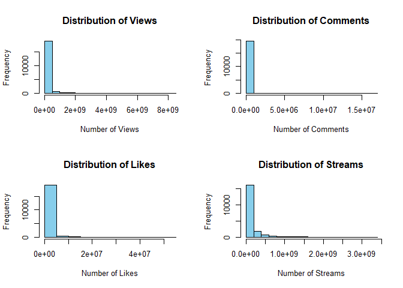<!-- -->

**Omitting outliers**

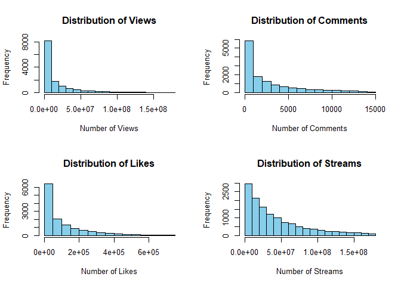<!-- -->

**Log-transformation**

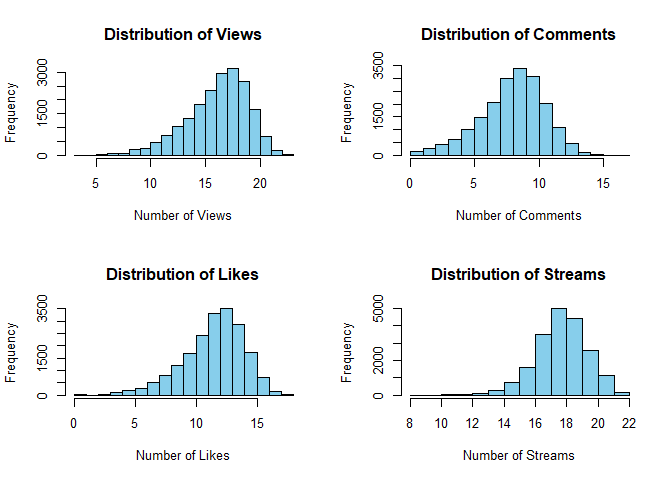<!-- -->

### Independent Variable Distributions

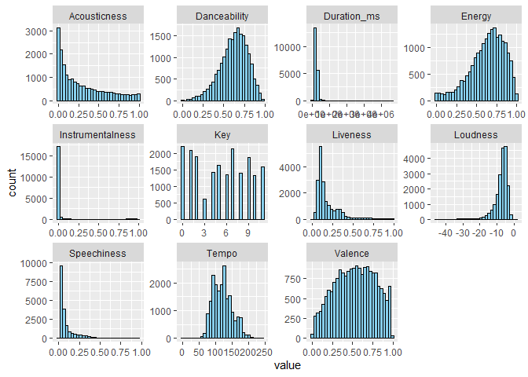<!-- -->

### Correlation Plot

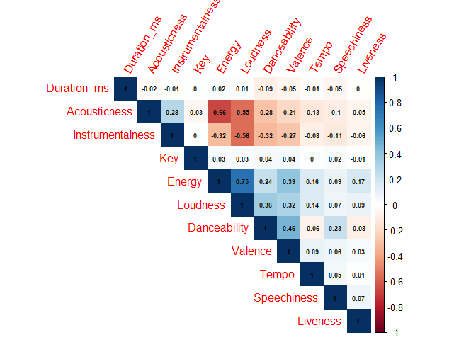<!-- -->

## Multiple Multivariate Regression Analysis

- I fit the model with theoretical formulas.
- I perfomed diagnostic checks by using `ggplot2` for the residual plots.
- I performed a log-transformation after determing a transformation necessary from the residual plots and then checked for normality using a Q-Q plot.
- I performed a boostrap study to create 95% confidence intervals for the R-square value of our transformed model.
- I conducted a likelihood ratio test for omitting variables from the model.

### Residual Plots

Here is the residual plot for the multiple multivariate model without any transformations

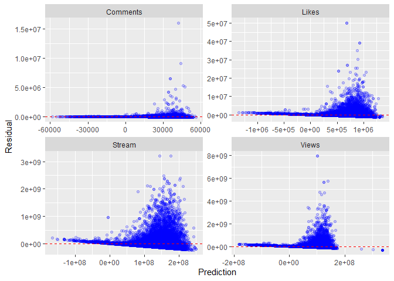<!-- -->

Here is the residual plot using a log-transformation

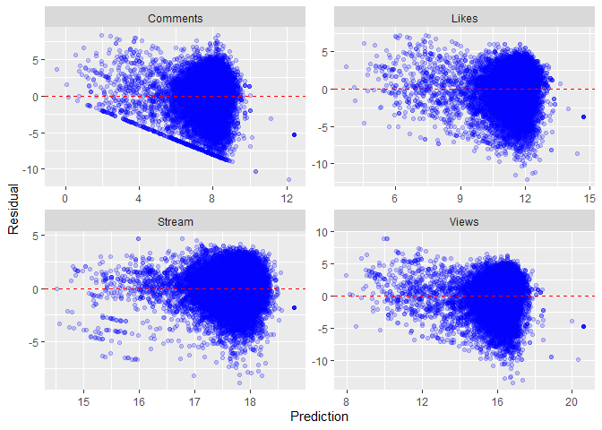<!-- -->

### Q-Q Plot

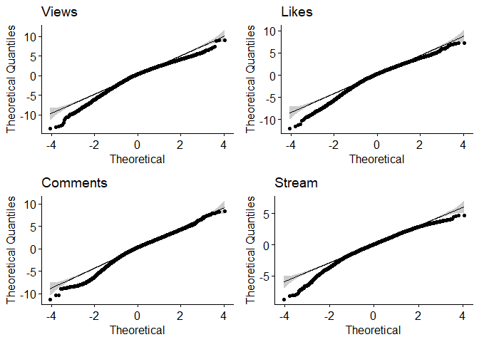<!-- -->

### Bootstrap Distributions

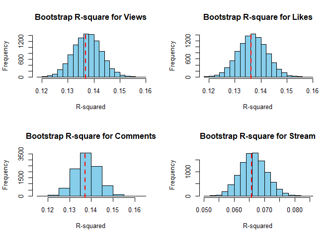<!-- -->

## MANOVA

- I created grouped bar plots to compare the means of album types. I data wrangled using `group_by` and `summarise` to create an adequate dataframe to create scaled barplots for easier comparison.
- I calculated the within-group sum of squares and cross product matrix `W`, between-group sum of squares and cross product matrix `B`, and Wilk's Lambda using theoretical formulas and distributions for 3 groups and multiple variables.
- I checked equality of covariance matrices via the Box's M test.

### Grouped Bar Plots

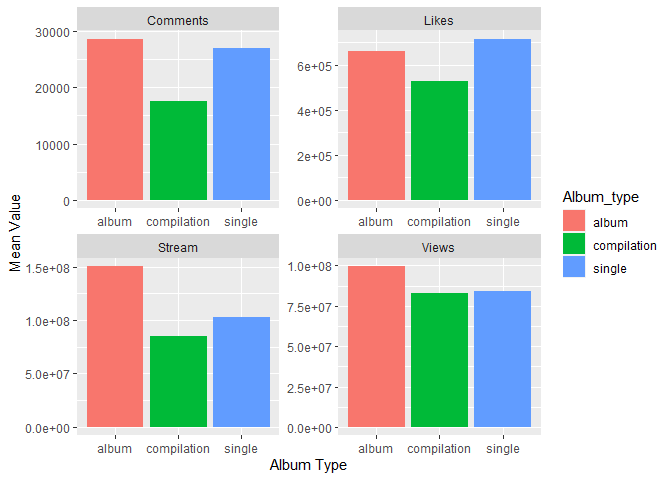<!-- -->

### Scaled Grouped Bar Plots

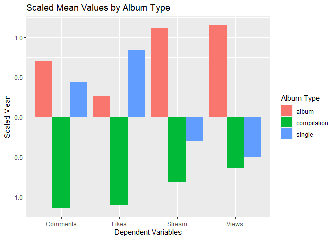<!-- -->

## Results

### Multiple Multivariate Regression Analysis 

- **Model Performace**:  The R-squared values for the non-transformed model are very low. However, the R-squared values for our log-transformed model were very reasonable given the difficulty of the research question at hand. This result suggests our model does a reasonable job at explaining unexplained variance and can decently predict a song's popularity.

- **Feature Importance**: `Danceability`, `Loudness`, and `Duration_ms` seemed to have a positive association with song popularity across all metrics (Views, Likes, Comments, Stream). `Energy`, `Speechiness`, `Acousticness`, `Instrumentalness`, `Liveness`, and `Valence` were negatively associated with song popularity across all metrics.

- **Omission**: Conducting a likelihood ratio test showed that `Key` and `Tempo`, despite having smaller coefficients, could not be omitted from the model as they showed a statistically significant linear relationship with the outcome variables.

- **Improvements**: Future research could look into the interaction effects between variables or other non-linear relationships. Additional variables not considered in this study may also contribute to song popularity.

### One-Way Manova

- Significant differences found in the popularity means across different `Album_types`.

- Rejection of the null hypothesis according to the Wilk's Lambda test.

- Violation of equal covariance matrices assumption detected by the Box's M-test.

- Results should be interpreted with caution due to the violation of the assumption.

- Additional studies are required to explore and correct for the unequal covariance matrices, possibly considering interactions, different statistical methods or data transformations.
